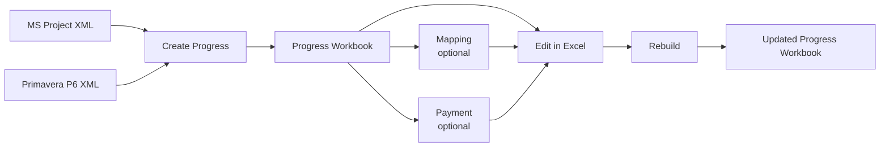

# Progress Studio

Progress Studio is a desktop application for turning construction schedule data into an Excel progress workbook, mapping BOQ amounts to schedule activities, preparing payment views, and rebuilding derived workbook outputs after the workbook has been edited in Excel.

> Development status: pre-production stabilization. The repository is being cleaned, documented, regression-tested, and packaged before Windows and macOS production releases.

## Product flow



### Inputs

- Microsoft Project XML.
- Primavera P6 XML.
- BOQ workbook when Mapping is used.
- An existing Progress Studio workbook when Rebuild is used.

### Main outputs

A generated workbook can contain:

- `main` — editable weekly source of truth after initial workbook creation.
- `main_monthly` — monthly presentation derived from weekly progress.
- `Dashboard` — KPI, S-curve, cutoff controls, and Activity Progress.
- `Payment Input` / `Payment` — when the Payment workflow is used.
- hidden/internal helper sheets used by Progress Studio.

## Typical workflow

1. **Create Progress** — import MSP XML or P6 XML and create the initial workbook.
2. **Mapping (optional)** — allocate BOQ amounts to schedule Activities.
3. **Payment (optional)** — prepare payment requirements and render payment lines.
4. **Edit in Excel** — update the workbook. `main` remains the workbook source of truth.
5. **Rebuild** — regenerate Progress-owned or Payment-owned outputs from the edited workbook.

For the detailed user workflow, see [docs/USER_WORKFLOW.md](docs/USER_WORKFLOW.md).

## Reporting timescale

Progress Studio distinguishes display margins from reporting periods:

```text
X  X  X | W1 W2 W3 ... Wn | X X X
          project reporting

X | M1 M2 M3 ... Mn | X
```

- `X` = display-only margin period.
- `W1...Wn` = weekly reporting periods.
- `M1...Mn` = monthly reporting periods.
- Create Progress owns the initial `X/W/M` labels.
- Rebuild does not renumber the weekly labels in `main`.

Calculation and reporting engines use dates/columns rather than the numeric W/M label as business identity.

## Quick start for developers

### Windows PowerShell

```powershell
py -3.11 -m venv .venv
.venv\Scripts\Activate.ps1
python -m pip install --upgrade pip
pip install -e ".[dev]"
progress-studio
```

### macOS / Linux

```bash
python3.11 -m venv .venv
source .venv/bin/activate
python -m pip install --upgrade pip
pip install -e ".[dev]"
progress-studio
```

Available entry points:

```text
progress-studio            Desktop GUI
python -m progress_studio  Desktop GUI
progress-studio-cli        CLI
python desktop.py          Compatibility desktop launcher
python main.py             Compatibility CLI launcher
```

## Repository map

```text
progress_studio/   Product code
  app/             Application composition and desktop pipeline
  domain/          Source-neutral models and contracts
  services/        Use cases and orchestration
  infrastructure/  XML, Excel, filesystem, renderers and persistence
  presentation/    CLI / GUI presentation
  pipeline/        Initial Create Progress pipeline steps
  config/          Workbook and UI configuration

tests/             Automated tests and fixtures
docs/              Active documentation + historical records
scripts/           Test/benchmark utilities
example/           Small example inputs and golden reference files
```

## Documentation

- [Architecture](ARCHITECTURE.md) — technical source of truth and ownership boundaries.
- [User workflow](docs/USER_WORKFLOW.md) — product workflow and workbook rules.
- [Development](docs/DEVELOPMENT.md) — environment, repository rules and performance policy.
- [Testing](docs/TESTING.md) — current automated test tiers.
- [Roadmap](ROADMAP.md) — pre-production milestones.
- [Release checklist](RELEASE_CHECKLIST.md) — release/installer gate.
- [Changelog](CHANGELOG.md) — historical changes.
- [Documentation index](docs/README.md).

Historical milestone documents and older user guides are preserved under `docs/history/`. They are reference material, not current product contracts.

## Important workbook rules

- `main` is the editable workbook source of truth after Create Progress.
- `main_monthly` and generated dashboards/helpers are derived outputs.
- F9 / Save recalculates Excel formulas; it does **not** run the Python Rebuild engine.
- Python-owned snapshots/caches require Progress Studio Rebuild when structural data changes.
- Payment-only rebuild must preserve Progress-owned outputs.
- Progress rebuild must preserve Payment-owned/user-owned inputs according to the Rebuild contract.

## Tests

Fast local gate:

```powershell
python -m pytest -m smoke -q
```

Full release gate:

```powershell
python -m pytest -m release
```

See [docs/TESTING.md](docs/TESTING.md) for the current tiering policy.
